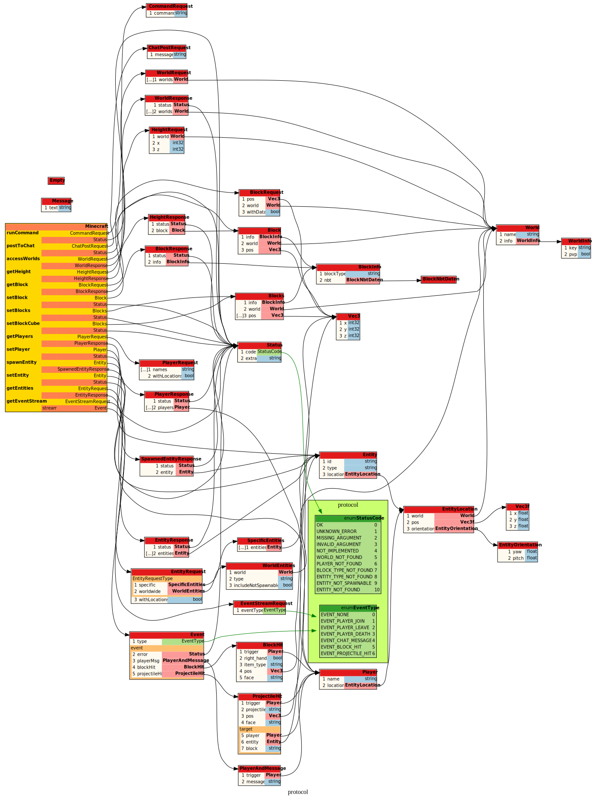

# Minecraft Protobuf Queries (MCPQ) Protocol

This repository holds the [Protocol Buffer (Protobuf)](https://protobuf.dev/overview/) files used by [gRPC](https://grpc.io/) to generate the remote procedure call (RPC) communication used to communicate between a Minecraft Java server via a [plugin](https://github.com/mcpq/mcpq-plugin) and its [client libraries](https://github.com/mcpq/mcpq-plugin?tab=readme-ov-file#client-libraries).

The only reason why you might be interested in these files is:

* You want to implement your own plugin/interface to communicate with
* You want to implement your own client library, maybe in a new language

Otherwise, if you just want to use the communication protocol, check out the already implemented [plugin](https://github.com/mcpq/mcpq-plugin) and its [client libraries](https://github.com/mcpq/mcpq-plugin?tab=readme-ov-file#client-libraries).

## Why Protobuf (gRPC)?

Using this protocol has a number of advantages:

* It supports a [large number of programming languages](https://grpc.io/docs/languages/).
* Is safe for multi-threading (on the same connection)
* Is fast (binary encoding) and established (used by Google)

Check out the [official documentation](https://protobuf.dev/overview/).

## How to use?

You can either download the version of the [minecraft.proto](minecraft.proto) file that you want to implement, or better, integrate this repository as a `git submodule`:

```bash
# add the submodule, potentiall in a subdirectory named 'proto'
git submodule add https://github.com/mcpq/mcpq-proto <optional-submodule/>proto
cd <optional-submodule/>proto
# checkout the version/tag/commit of the protocol you want to use
git checkout v1
# return to root of repository
cd ..  
# fix the version by adding and commiting it
git add <optional-submodule/>proto
# when adding a submodule for the first time, also add this 
git add .gitmodules
```

If you want to change the version of an existing submodule:

```bash
cd <optional-submodule/>proto
# checkout the version/tag/commit of the protocol you want to use
git checkout <?>
# return to root of repository
cd .. 
# fix the version by adding and commiting it
git add <optional-submodule/>proto
git commit -m "updated protocol to version ?"
```

To clone a repository with submodules (or update an existing one):

```bash
# clone the repository and all its submodules
git clone --recurse-submodules <repository-with-submodules>

# or use the following in an already cloned repository to update
git submodule update --init --recursive
```

## What operations does the protocol support/specify?

Checkout the [minecraft.proto](minecraft.proto) file, which is visualized below using `protodot`:




## Version Changes


| Version (Tag) | Backward Compatible | Forward Compatible |
| :-----------: | :-----------------: | :----------------: |
|      v1       |          -          |         -          |

> Software using this protocol should specify which version of the protocol they are using (e.g. as their major version number)

## License

[LGPLv3](LICENSE)

> Note: The *intent* behind the chosen license, is to allow the licensed software to be *used* (as is) in any type of project, even commercial or closed-source ones.
> However, changes or modifications *to the licensed software itself* must be shared via the same license openly.
> Checkout [this blog](https://fossa.com/blog/open-source-software-licenses-101-lgpl-license/) for an in-depth explanation.
